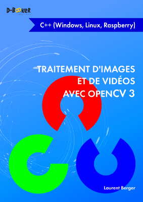

## Traitement d'images et de vidéos avec OpenCV 3
### en C++ (Windows, Linux, Raspberry)

Ce dépôt contient les codes sources des exemples du livre [Traitement d'images et de vidéos avec OpenCV 3
 en C++ (Windows, Linux, Raspberry)](https://www.d-booker.fr/opencv/510-traitement-d-images-et-de-videos-avec-opencv-3.html).

Ce livre est écrit par Laurent Berger
et publié par les éditions [D-BookeR](http://www.d-booker.fr).

Chaque dossier contient un fichier CMakeLists.txt permettant de construire l'exemple. Vous pouvez aussi les installer en lançant le script installExemple.sh.

Si ces exemples vous intéressent et que vous n'avez pas acheté le livre, nous vous invitons à le [faire](https://www.d-booker.fr/opencv/510-traitement-d-images-et-de-videos-avec-opencv-3.html). Sa rédaction est le fruit d'un gros travail et votre soutien nous sera précieux.

